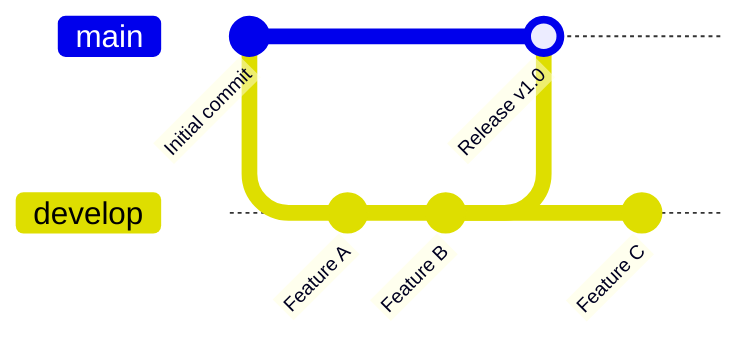

# 🚀 Deployment Guide

## Overview

The G-Nexus project uses an automated GitHub Actions-based CI/CD pipeline to deploy to cPanel hosting. We maintain two environments:

- **Production**: https://gnexuset.com (`main` branch)
- **Test**: https://gnexuset.com/test (`develop` branch)

## Branch Strategy



### Branches

- **`main`**: Production-ready code. Merges to this branch trigger deployment to https://gnexuset.com
- **`develop`**: Testing and staging. Pushes trigger deployment to https://gnexuset.com/test
- **Feature branches**: Created from `develop`, merged back via pull requests

## Deployment Process

### Automatic Deployments

1. **Test Environment** (gnexuset.com/test):
   ```bash
   git checkout develop
   git add .
   git commit -m "Add new feature"
   git push origin develop
   # ✅ Automatically deploys to test environment
   ```

2. **Production Environment** (gnexuset.com):
   ```bash
   git checkout main
   git merge develop
   git push origin main
   # ✅ Automatically deploys to production
   ```

### Manual Deployments

GitHub Actions workflows can also be triggered manually:

1. Go to GitHub repository → **Actions** tab
2. Select the workflow (e.g., "Deploy to Production")
3. Click **Run workflow** → Select branch → **Run workflow**

## Workflows

### 1. Deploy to Production (`deploy-production.yml`)

**Triggers**: Push to `main` branch or manual trigger

**Steps**:
1. 🧹 Lint & Type Check
2. 🧪 Run Tests
3. 🏗️ Build for Production (base path: `/`)
4. 📂 Deploy to cPanel (`./public_html/`)
5. ✅ Verify deployment

### 2. Deploy to Test (`deploy-test.yml`)

**Triggers**: Push to `develop` branch or manual trigger

**Steps**:
1. 🧹 Lint & Type Check
2. 🧪 Run Tests
3. 🏗️ Build for Test (base path: `/test`)
4. 📂 Deploy to cPanel (`./public_html/test/`)
5. ✅ Verify deployment

### 3. CI Quality Checks (`ci.yml`)

**Triggers**: Pull requests and pushes to feature branches

**Steps**:
1. 🧹 Run ESLint
2. 🔍 Type checking
3. 🧪 Run tests
4. 🏗️ Test build

## GitHub Secrets Configuration

The following secrets must be configured in GitHub repository settings:

| Secret Name | Description | Example Value |
|------------|-------------|---------------|
| `FTP_SERVER` | cPanel FTP hostname | `ftp.gnexuset.com` |
| `FTP_USERNAME` | FTP username | `gnex@gnexuset.com` |
| `FTP_PASSWORD` | FTP password | `***********` |

### How to Add Secrets

1. Go to GitHub repository → **Settings**
2. Navigate to **Secrets and variables** → **Actions**
3. Click **New repository secret**
4. Add each secret from the table above

## Environment Variables

Environment-specific variables are managed through `.env` files:

- `.env.production` - Production environment
- `.env.test` - Test environment
- `.env.example` - Template for local development

### Important Variables

```bash
# Base path for routing (automatically set by build)
VITE_BASE_PATH=/          # Production
VITE_BASE_PATH=/test      # Test

# Supabase Configuration
VITE_SUPABASE_PROJECT_ID="your-project-id"
VITE_SUPABASE_PUBLISHABLE_KEY="your-key"
VITE_SUPABASE_URL="https://your-project.supabase.co"

# Analytics
VITE_GA_MEASUREMENT_ID=G-XXXXXXXXXX
VITE_ANALYTICS_ENABLED=true
```

## Local Development

```bash
# Start development server
npm run dev

# Test production build locally
npm run build
npm run preview

# Test with subdirectory path (simulating /test)
VITE_BASE_PATH=/test npm run build
```

## Troubleshooting

### Deployment Failed

**Check GitHub Actions logs**:
1. Go to repository → **Actions** tab
2. Click on the failed workflow run
3. Expand failed job steps to see error details

**Common issues**:
- ❌ FTP credentials incorrect → Update GitHub Secrets
- ❌ Build failed → Check linting/type errors locally
- ❌ Tests failed → Run `npm test` locally to debug

### Site Not Loading After Deployment

**Assets returning 404**:
- Check the build used correct `VITE_BASE_PATH`
- For test environment, verify assets load from `/test/assets/`
- Check browser console for specific 404 errors

**React Router not working (404 on refresh)**:
- Verify `.htaccess` file was deployed
- Check cPanel allows `.htaccess` overrides
- Verify `AllowOverride All` is set in Apache config

**Blank page**:
- Check browser console for JavaScript errors
- Verify environment variables are set correctly
- Check that API endpoints are accessible

### Rolling Back

If a deployment causes issues:

1. **Quick rollback** - Deploy previous commit:
   ```bash
   git checkout main
   git reset --hard <previous-commit-sha>
   git push --force origin main
   # This triggers automatic redeployment
   ```

2. **Manual rollback** - Use GitHub Actions:
   - Go to **Actions** → **Rollback Production** workflow
   - Click **Run workflow**
   - Enter the commit SHA to rollback to
   - Run workflow

## Monitoring

### Post-Deployment Checks

After each deployment, verify:

✅ **Homepage loads**: Visit the URL and confirm the site loads  
✅ **Routing works**: Navigate to different pages (e.g., `/chat`, `/explore`)  
✅ **Refresh works**: Refresh a non-root page (tests `.htaccess`)  
✅ **Assets load**: Check browser DevTools → Network tab for 404s  
✅ **No console errors**: Check browser console for JavaScript errors  
✅ **API connectivity**: Test features that use backend APIs

### Performance Monitoring

Use tools like:
- **Google Lighthouse**: Check performance, accessibility, SEO
- **Google Analytics**: Monitor traffic and user behavior (if enabled)
- **Browser DevTools**: Check load times and network performance

## cPanel Configuration

### Directory Structure

```
public_html/
├── index.html              # Production site
├── .htaccess              # Apache config for production
├── assets/                # Production assets
│   ├── js/
│   ├── css/
│   └── images/
└── test/                  # Test environment subdirectory
    ├── index.html         # Test site
    ├── .htaccess         # Apache config for test (if needed)
    └── assets/           # Test assets
```

### Apache Configuration

The `.htaccess` file handles:
- Single Page Application (SPA) routing
- React Router support (no 404s on refresh)
- Asset caching
- CORS headers for API requests
- Compression

## Advanced Usage

### Creating a New Environment

To add a staging environment:

1. Create `.env.staging`:
   ```bash
   VITE_BASE_PATH=/staging
   ```

2. Create `.github/workflows/deploy-staging.yml`:
   ```yaml
   name: Deploy to Staging
   on:
     push:
       branches: [staging]
   # ... similar to deploy-test.yml
   ```

3. Create `staging` branch:
   ```bash
   git checkout -b staging develop
   git push origin staging
   ```

### Custom Deployment Scripts

For local FTP deployment (emergency use):

```bash
# Build locally
npm run build

# Deploy manually via FTP client
# Use credentials from GitHub Secrets
```

## Best Practices

1. **Always test in develop branch first** before merging to main
2. **Use pull requests** for code review before merging
3. **Run tests locally** before pushing: `npm test`
4. **Check type errors**: `npm run type-check`
5. **Monitor deployment logs** in GitHub Actions
6. **Verify deployments** after each push to main/develop
7. **Keep secrets secure** - never commit credentials to git

## Support

For issues or questions:
- Check GitHub Actions logs for deployment errors
- Review this documentation
- Contact the development team

---

**Last Updated**: 2026-02-16  
**Maintained by**: G-Nexus Development Team
